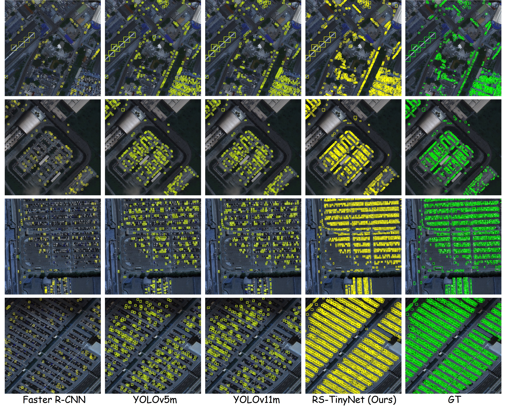

# AeroTinyNet: A Multi-Dimensional Attention Network for Tiny and Small Object Detection in UAV and Satellite Imagery
Authors: Xiaozheng Jiang*, Wei Zhang*, Xuerui Mao** and Haifeng Tan**

*:  The authors contributed equally to this work.

**: Corresponding author

# Overview
Detecting tiny and small objects in aerial imagery has long been a challenging task due to their minimal spatial information, weak feature representations, and dense distributions across complex backgrounds. Despite numerous efforts devoted, mainstream detectors still underperform in such scenarios. To bridge this gap, we introduce AeroTinyNet, a novel detection framework specifically tailored for detecting tiny and small objects in unmanned aerial vehicle (UAV) and satellite imagery. The core design of AeroTinyNet is a multi-dimensional collaborative attention (MDCA) mechanism, which jointly integrates channel-spatial dependencies and global-local contextual cues to enhance the saliency and discriminability of tiny objects and suppress background interference. Moreover, MDCA is lightweight and flexible, allowing seamless integration into different stages of the detection pipeline for progressive feature refinement. Comprehensive experiments conducted on the public VisDrone dataset demonstrate that AeroTinyNet achieves a 1.7\% improvement in $\mathrm{mAP_{50}}$ over recent high-performing detectors, and AI-TOD shows that our model surpasses existing state-of-the-art (SOTA) detectors by 4.0\% AP and 6.5\% $\mathrm{AP_{75}}$. Evaluations on the DIOR benchmark dataset further validate its superior detection performance in diverse aerial scenarios. These results demonstrate that the proposed multi-dimensional attention network offers an effective and practical solution for tiny object detection in challenging aerial scenarios.

# Result

